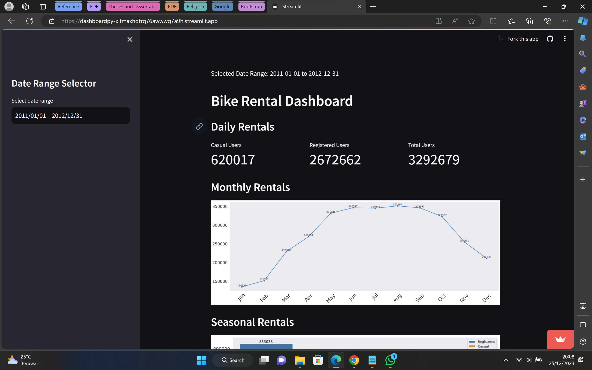
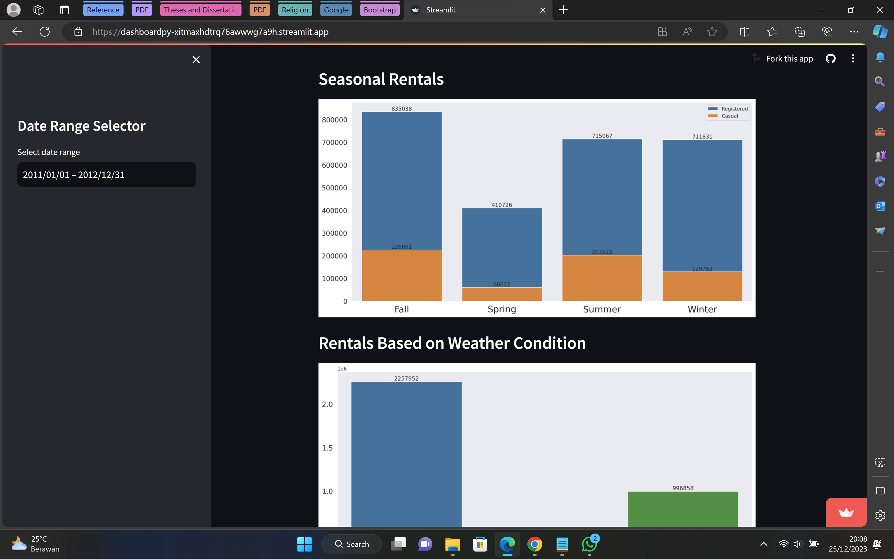
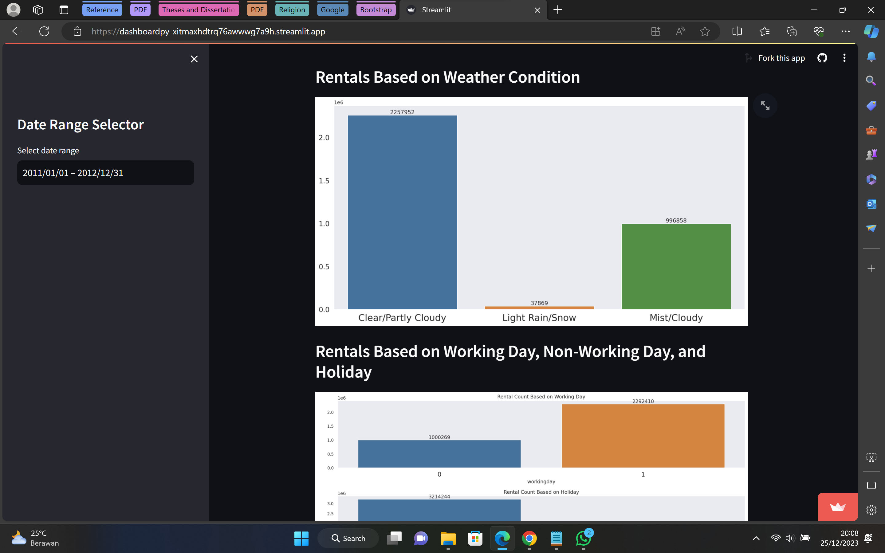
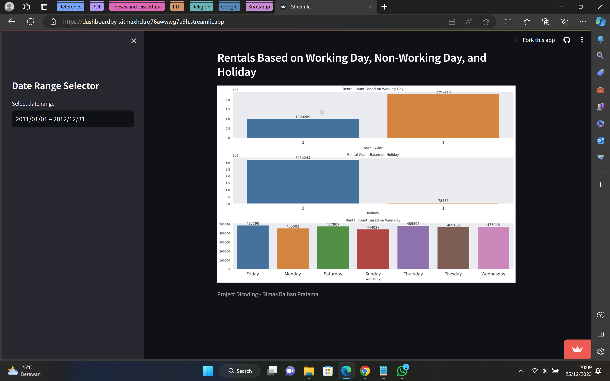

# Bike Rentals - Final Assignment
> This project is the final project from Dicoding for the course "Learning Data Analysis With Python". Check the dashboard [Here](https://dashboardpy-xitmaxhdtrq76awwwg7a9h.streamlit.app/)

## A. Assignment Process
1. Data Wrangling:
```
- Gathering data
- Assessing data
- Cleaning data
```
2. Exploratory Data Analysis:
```
- Defined business questions for data exploration
- Create Data exploration
```
3. Data Visualization:
```
- Create Data Visualization that answer business questions
```
4. Dashboard:
```
- Set up the DataFrame which will be used
- Make filter components on the dashboard
- Complete the dashboard with various data visualizations
```

## B. How to Use
**`Dimas_Raihan_Pratama_Bike_Sharing.ipynb`**
1. Retrieve this project by downloading it.
2. Launch your preferred Integrated Development Environment (IDE) such as Jupyter Notebook or Google Colaboratory (for this instance, Google Colab will be utilized).
3. Generate a new notebook.
4. Import and designate the file with a .ipynb extension.
5. Establish a connection to the hosted runtime.
6. Finally, execute the code cells.

**`dashboard/dashboard.py`**
1. Retrieve this project by downloading it.
2. In your terminal or command prompt, use the command pip install streamlit to install Streamlit. Additionally, install other libraries such as pandas, numpy, scipy, matplotlib, and seaborn if they are not already installed.
3. Ensure that the CSV file remains in the same folder as the dashboard.py file since it serves as a data source.
4. Open Visual Studio Code (VSCode) and execute the file by navigating to the terminal, then input streamlit run dashboard.py.

## C. Dashboard Screenshots




